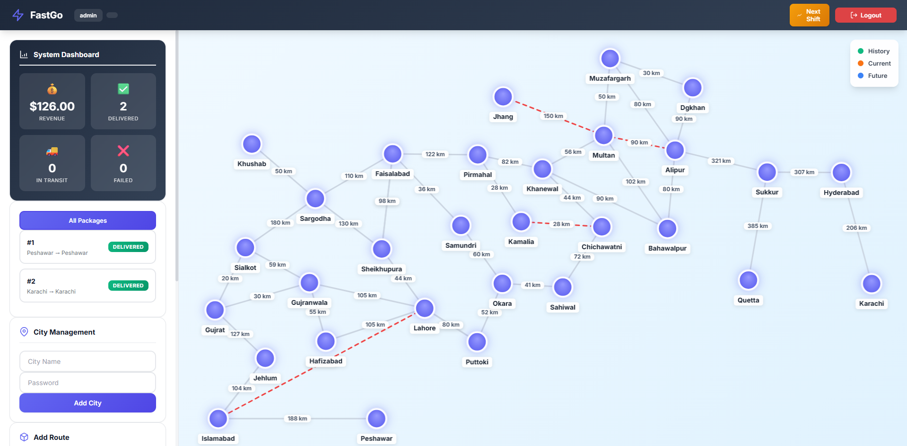

# FastGo Logistics 📦🚚



## 🚀 Overview
**FastGo Logistics** is a full-stack courier management simulation engine designed to demonstrate the practical application of **Data Structures and Algorithms (DSA)** in real-world software engineering.

Developed as a final semester project for the Data Structures and Algorithms course at University of Engineering and Technology, this system replaces high-level abstractions with custom-engineered data structures. It features a high-performance **C++ backend** handling complex graph routing and simulation, paired with a dynamic **HTML5/JavaScript frontend** for real-time visualization.

---

## 🌟 Key Features

* **Dynamic Pathfinding:** Implements **Dijkstra's Algorithm** to calculate optimal routes between cities instantly.
* **Real-Time Rerouting:** The system automatically detects "blocked" roads (edges) and recalculates paths for in-transit packages immediately.
* **Custom Data Structures:** Utilizes custom-built **Hash Tables** and **Adjacency Lists** instead of relying solely on standard libraries, ensuring **O(1) lookups** and efficient memory usage.
* **Interactive Graph Visualization:** A custom map interface (**HTML5 Canvas**) where Admins can drag-and-drop city nodes, with coordinates syncing live to the database.
* **Role-Based Access Control:** Distinct modules for Admins (Network Management), Managers (Shipment Processing), Riders (Last-Mile Delivery), and Guests (Tracking).
* **Time-Step Simulation:** A discrete event simulation engine that advances package movement, updates tracking history, and manages delivery logic.

---

## 🛠️ Tech Stack

### Backend
| Component | Technology | Description |
| :--- | :--- | :--- |
| **Language** | C++ (Std 17/20) | Core logic and memory management. |
| **Framework** | Crow | C++ Microframework for Web/API. |
| **Database** | SQLite3 | Persistent storage for topology, packages, and users. |
| **Concepts** | Graph Theory, Hashing | Custom implementations (Open Addressing, OOP). |

### Frontend
| Component | Technology | Description |
| :--- | :--- | :--- |
| **Languages** | HTML5, CSS3, JS | ES6+ for dynamic interactions. |
| **Visualization** | HTML5 Canvas API | Rendering the interactive node/edge map. |
| **API** | REST (Fetch) | Asynchronous communication with the C++ backend. |

---

## 📂 Architecture & Class Structure

The project is architected around several specialized C++ classes, each managing a specific domain of the logistics engine.

### 1. `FastGo.h` (The Core Engine)
The central controller class that acts as the brain of the application.
* **Orchestration:** Runs the simulation loop (`runTimeStep`), moving packages based on priority (Overnight/Standard).
* **Security:** Manages user authentication and role validation.
* **Bridge:** Acts as the interface between the REST API (Crow) and underlying data structures.
* **Pricing:** Calculates dynamic shipping costs based on weight and service type.

### 2. `CustomGraph.h` (The Network Brain)
Represents the logistics network as a weighted graph.
* **Nodes:** Manages Cities with geospatial data (X, Y coordinates).
* **Edges:** Manages Routes with weights (distances) and status (Blocked/Active).
* **Pathfinding:** Implements **Dijkstra’s Algorithm** (`getShortestPath`) for routing.
* **Next Hop:** Determines the immediate next city for a package.

### 3. `CustomHash.h` (High-Performance Storage)
Contains custom implementations of Hash Tables to optimize data retrieval.
* **`SimpleHash` Class:** Manages City data using a custom hash function and **quadratic probing** for collision resolution.
* **`hashroutes` Class:** Manages Route data. Optimized for checking connection existence and blockage status in **O(1)** time.

### 4. `Database.h` (Persistence Layer)
Handles all direct Input/Output operations with the SQLite database files.
* **CityDatabase:** Loads/saves city nodes and dragged positions (`cities.db`).
* **SaveRoute:** Persists network connections and blocked states (`routes.db`).
* **RiderDatabase:** Manages courier accounts and assignments (`riders.db`).

### 5. `Package.h` (The Data Model)
Defines the Package entity and manages its lifecycle state.
* **Attributes:** Sender, Receiver, Weight, Type, and Price.
* **Tracking History:** Serialized log of visited cities (Visualized as the **Green Line**).
* **Route Plan:** Calculated future path (Visualized as the **Blue Dashed Line**).
* **State Machine:** Created → In Transit → Arrived → Out For Delivery → Delivered/Returned.

---

## 🚀 Installation & Setup

### Prerequisites
* C++ Compiler (g++ or MSVC) supporting **C++17**.
* **CMake** (Optional, but recommended).
* **Crow** (Header-only library, usually included in `include/`).
* **SQLite3** (Library must be installed and linked).

### Build Instructions

1.  **Clone the Repository**
    ```bash
    git clone [https://github.com/YourUsername/FastGo-Logistics.git](https://github.com/YourUsername/FastGo-Logistics.git)
    cd FastGo-Logistics
    ```

2.  **Compile the Project**
    *Using g++ (Linux/Mac/MinGW):*
    ```bash
    g++ main.cpp -o FastGo -lsqlite3 -lpthread
    ```

3.  **Run the Server**
    ```bash
    ./FastGo
    ```
    *The server will start on port 8080.*

4.  **Access the Dashboard**
    Open your browser and navigate to: `http://localhost:8080`

---

## 🎮 Usage Guide

### 1. Admin Module
* **Login:** `admin` / `admin123`
* **Map Editor:** Drag cities to rearrange the map visualization.
* **Network Control:** Create new cities or connect them with routes.
* **Traffic Simulation:** Click "Block" on any route to trigger system-wide rerouting.
* **Time Control:** Use "Next Shift" to simulate the passage of time.

### 2. Manager Module
* **Login:** Use any city name created by the Admin (password is set during creation).
* **Operations:** Create shipments, view incoming/outgoing logistics, and assign arrived packages to Riders.

### 3. Rider Module
* **Login:** Credentials created by the City Manager.
* **Operations:** View assigned deliveries and mark them as Delivered or Failed (triggering returns).

### 4. Guest Tracking
* Use the **"Track Package"** feature on the login screen with a **Package ID** to see its live journey on the map.

---

## 🤝 Acknowledgments

* **University:** University of Engineering and Technology
* **Course:** Data Structures and Algorithms (DSA)

---
© 2026 Abdul-Manan-PG. All Rights Reserved.
